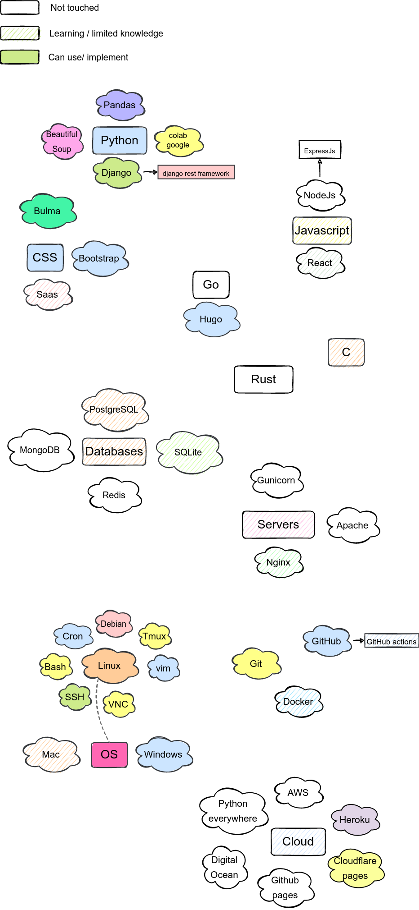

# My stack
Here I share technologies I know / willing to learn

### Preview

### I want to make something similar:
1. fork me
2. git clone thefork
3. go to [Drawio web interface](https://app.diagrams.net/)
4. file > import from > device
5. make something beautiful
6. file > export as > png : [x] Transparent bg > download > put in clone local directory
7. commit and push

### Todo
- [ ] Auto generate the preview (with github-actions and docker?)(currently exported from Drawio manually)

### Credit/ Thanks:
All open source projects mentioned above and the great people behind them.

Diagram made using [Drawio](https://github.com/jgraph/drawio)
